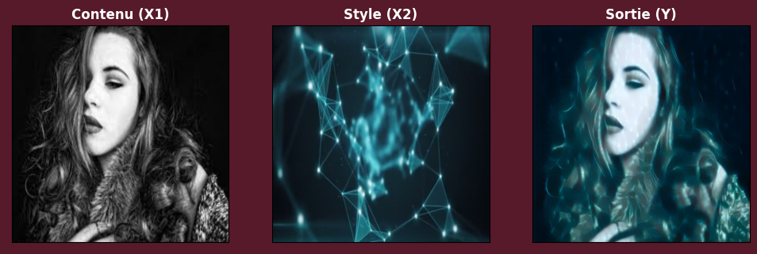
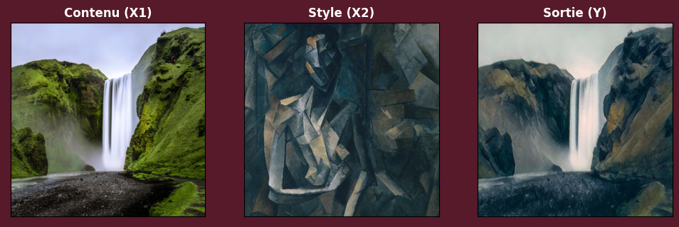

# Deep Learning : Transfert de style d'images

**Auteurs : [Paul-Antoine Inghelbrecht](https://github.com/NotGluGlu), [Joël Hamilcaro](https://github.com/Joel-Hamilcaro/), [Jie Tu](https://github.com/jie-tu)**

**Projet : [Notebook viewer](https://nbviewer.org/github/JJPA-Project/Image-Style-Transfer/blob/main/1_Projet_HAMILCARO_TU_INGHELBRECHT.ipynb)**

**Architecture neuronale : VGG-19 Pré-entrainé**

## Résumé du projet :

L'objectif de ce projet était de réaliser un algorithme de transfert de style d'images. Après avoir étudié différents papiers de recherches, nous avons conclu que les types de structures que l'on peut utiliser pour mettre au point un algorithme de transfert de style sont les suivants :

- **(1) « Un algorithme neuronal du style artistique »** ([Gatys, Ecker, Bethge](https://arxiv.org/abs/1508.06576))
- **(2) Un modèle entraîné pour le transfert d'un seul style** ([Johnson, Alahi, Fei-Fei](https://arxiv.org/abs/1603.08155))
- **(3) Modèle pré-entraîné pour tout type de transfert arbitraire** [Huang](https://arxiv.org/abs/1703.06868) et [Ghiasi](https://arxiv.org/abs/1705.06830).

Dans ce projet, nous avons opté pour la première méthode. Puis, en extension nous avons essayé d'implémenter les deux autres.

## Notebooks :

- [`1_Projet_HAMILCARO_TU_INGHELBRECHT.ipypnb`](https://nbviewer.org/github/JJPA-Project/Image-Style-Transfer/blob/main/1_Projet_HAMILCARO_TU_INGHELBRECHT.ipynb) : Contient l'intégralité du projet dans lequel nous avons implémenté le modèle **(1)**. Nous l'avons créé pas à pas, puis nous avons cherché à l'améliorer et à l'optimiser de manière la plus fine possible (variation des hyperparamètres, tests avec différents optimiseurs, etc.). Nous avons obtenu des résultats très satisfaisant à la fois en terme de rapidité d'exécution et de qualité d'images. En effet, cette approche est très rapide (même sans GPU), et les images générées en sortie sont très satisfaisantes.

- [`2_Annexe_HAMILCARO_TU_INGHELBRECHT.ipypnb`](https://nbviewer.org/github/JJPA-Project/Image-Style-Transfer/blob/main/2_Annexe_HAMILCARO_TU_INGHELBRECHT.ipynb) : En guise d'extension, nous avons fait une tentative d'implémentation d'une architecture spécialisée dans un seul style (qu'il pourra transférer à n'importe quelle image). Il s'agit du modèle cité dans l'article de [Johnson, Alahi et Fei-Fei](https://arxiv.org/abs/1603.08155). De même nous avons fait des recherches sur l'implémentation d'un modèle qui, en une seule étape d'entraînement, s'adapte à tout type de transfert : l' « Arbitrary Style Transfert », décrit notamment dans les papiers de [Huang](https://arxiv.org/abs/1703.06868) et [Ghiasi](https://arxiv.org/abs/1705.06830).

# Exemple de résultats :

